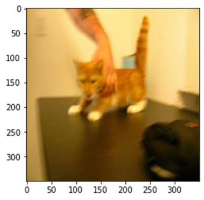
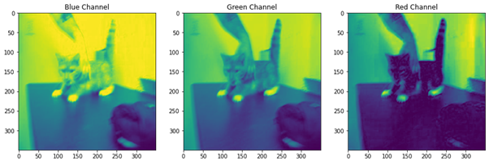
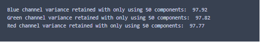
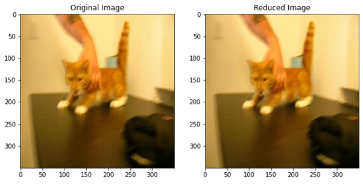
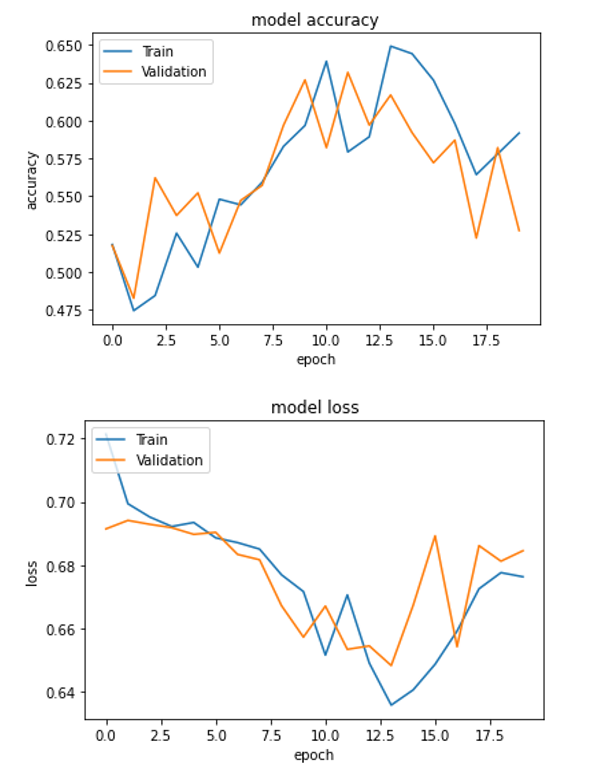

# Image-Classification - Binary with Principal Component Analysis

**Introduction**

Many real-world computer vision problems start with image classification. Image classification is important in a variety of fields, from medicine to security systems. The basic aim of image classification is for a model to identify a picture by the term of its class, based on how it was trained using an image dataset.
This project's objective is to develop an algorithm that can distinguish between cats and dogs. A dataset was utilized to train different machine learning models, and an algorithm was then used to differentiate images.

**Introduction to the dataset**

The dataset used for this project was sourced from Kaggle under the project Playground Prediction Competition, the dataset consists of a total of 1002 to images as training data and 100 images as test data.
The train dataset is equally distributed between dogs and cats with 501 images in each category, the initial observation is that all the images are of different shapes and size.

**Preprocessing Steps**

The dataset was pre-processed before the same cwas used In model training, for this purpose the following steps were carried out
1. Loading image from the train data path
2. Resizing all image to constant size 350*350
3. Normalising the array to store the values between 0 to 1
4. Storing the normalised data to a NumPy Array
5. Principle component analysis

**Principal Component Analysis**

The steps involved and performed as part of PCA are as follows:
The images used in this project are colour images with three channels: red, green, and blue. Each image's dimensions are 350 * 350 * 3, with 350 representing the image's height and breadth and 3 representing the three colours red, green, and blue.
Each picture channel was split from the original image using the CV2 module, and the values of each channel were stored in three independent NumPy arrays.

The original image, as well as the three different colour channels that were split, are displayed in the sample image below.

After splitting the images, the Scikit learn PCA was used to limit the number of components in each image to 50. The number of components was decreased from 350 to 50 in the first stage, after which the image was inverse converted and the explained variance ratio determined.
The explained variance ratio can be used to determine how much information was preserved after the dimension was reduced.
In this case, the variance was calculated for each image, and the overall average considering all the image was computed.

The Image above shows that around 98 percent of variance was kept across all channels; this number is the average for all photos.
In terms of dimensionality reduction, using only 50 components and maintaining 98 percent of the variance is quite good, and will aid in better and efficient model training.

The image below displays the original and the reduced with 50 components; it can be seen that the image is compressed with pixel deformation, but it is still extremely obvious in terms of shape and structural identification.

**Classification Models Used**

With the dataset pre-processed, split and prepared, machine learning models have been trained on top of it for image classification.
For model were trained using the training dataset:
1.	K-Nearest Neighbours Algorithm - KNN 
2.	Support Vector Machine Algorithm – SVM
3.	Random Forest Algorithm
4.	Convolutional Neural Network Algorithm – CNN

All of the models were trained on the train dataset, and the accuracy was calculated by predicting the validation data using the labels.

**Data Augmentation**

In data processing, data augmentation refers to approaches for increasing the amount of data by adding slightly changed copies of current data or creating new synthetic information from existing data. When training a machine learning model, it functions as a regularize and helps to reduce overfitting.
The following data augmentations were applied to the dataset before passing to CNN model:

•	Random flip of images – horizontally and vertically

•	Random zoom of images, based on both height and width

•	Random rotation of images 

**Results**

From training four different models it was observed that two models, Random Forest and CNN performed equally well with accuracy of 60.18 and 60.20 respectively. Considering this both the models have been taken up for further tuning

**Random Forest

GridSearchCV estimator was used for the purpose of find the optimum hyperparameters for the best model, after assessing multiple parameters the number of estimators and the criterion to be used were evaluated, with a 10-fold cross validation the best model fit parameters were identifies along with the best accuracy score

**CNN

The model Accuracy and loss is depicted in the above graph, the 12th epoch is chosen the best as, it can be observed after which the loss factor is increasing rapidly with deteriorating accuracy as well. 

With that, the best model in classification of dog vs cats is the hyperparameter tuned CNN model with an accuracy of 63.18 %.

**Conclusion**

The dataset was created using numerous pre-processing techniques such as normalizing, principal component analysis, and others, then machine learning techniques were utilized to build an effective model for image categorization of dog vs cat.
Four ML algorithms namely, KNN, Support vector machine, Random Forest and CNN were trained using the train dataset and accuracy predicted using validation data.
Hyperparameters were tuned for CNN and random forest as both showed equal performance metrics in training stage.
With multiple parameters tuned, it was observed that the CNN model performed best with an accuracy of 63.18 %.

The best model, CNN, was then used to predict the unseen test data.
